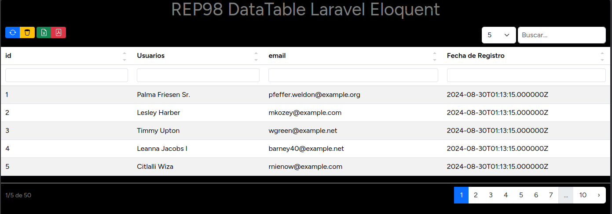

# DataTabla Laravel Eloquent

Un simple, pero potente datatable hecho para colecciones y eloquent de Laravel, su integración y uso es muy sencillo.



## Instalación

Primero integramos el componente a nuestro proyecto

```bash
composer require rep98/dt-laravel-eloquent
```

luego publicamos el proveedor

```bash
php artisan vendor:publish --provider="DTLaravelEloquent\RDataTableServiceProvider"
```

Y, por último, de forma opcional, podemos ejecutar para instalar el componente

```bash
php artisan RDT:install
```

Podemos pasar la bandera `--raw` si queremos modificar el js o css, [se recomienda tener npm]

## Uso

```php
use DTLaravelEloquent\RDT;

function index() {
    $dt = RDT::make(User::all())
        ->exclude(["password"])
        ->render()
    return view("auth.users", compact("dt"))
}
```

en Blade

```blade
{{-- para el export --}}
<meta name="csrf-token" content="{{ csrf_token() }}">
{{-- Añadimos los script --}}
<x-dt::scripts />
{{-- la tabla --}}
{!! $dt !!}
```

> ¿Simple no?

## Configuración

Este proyecto usa [`fiduswriter/simple-datatables`](https://fiduswriter.github.io/simple-datatables/) para el manejo efectivo de tablas, por ello sus configuraciones se ajustan a este componente

* `RDataTable` es el archivo de configuración base
* `RDTOptions` es la clase encargada de administrar las configuraciones y hacerlas compatibles como el js [`fiduswriter/simple-datatables`](https://fiduswriter.github.io/simple-datatables/)

### Opciones de configuración

Como he mencionado, todas las opciones de configuración son obtenidas del componente [`fiduswriter/simple-datatables`](https://fiduswriter.github.io/simple-datatables/) con algunos ajustes y excepciones.

A continuación explicaré los ajustes y excepciones si desea conocer el resto de opciones, visite [Opciones de Simple Datatables](https://fiduswriter.github.io/simple-datatables/documentation/Options)

| Opciones | valor por defecto | Descripción |
|----------|-------------------|-------------|
| `options`  | `array`           | Opciones de configuración del componente js|
| `export`   | `array`           | Opciones de exportación |

Opciones de Exportación

* `export.name` Contiene el nombre del archivo generado cuando se usa `Excel` o `PDF`.

Opciones de Configuración del Componente JS

| Opciones | valor por defecto | Descripción |
|----------|-------------------|-------------|
| `options.type` | `html` | Representa el tipo de datos en las celdas de las columnas. [Ver detalle](https://fiduswriter.github.io/simple-datatables/documentation/columns#type) |
| `options.format` | `YYYY-MM-DD` | Cadena que representa el formato cuando se utiliza el tipo fecha. |
| `options.locale` | `en` | Idioma de la tabla; por defecto, la clase `RDTOptions` intenta obtener el idioma de sus configuraciones aplicadas a `app.php` y las asigna a esta opción. |
| `options.perPage` | `20` | Cantidad de resultados por página |
| `options.perPageSelect` | `[5, 20, 50, 100, 150]` |  Matriz que permite al componente generar un selector para indicar cuántos resultados ver por página  |
| `options.labels` | `array` | Son textos que se muestran en el Datatable, por defecto, la clase `RDTOptions` intenta obtenerlos desde la carpeta lang del componente, para conocer más [aquí](https://fiduswriter.github.io/simple-datatables/documentation/labels) |

### Clase de configuración

La clase `RDTOptions` se usa para establecer opciones de configuración que luego serán transformadas en un objeto JavaScript para la librería [`fiduswriter/simple-datatables`](https://fiduswriter.github.io/simple-datatables/)

Sus miedos son:

* `__construct(array $options = [])` Inicializa la clase de opciones, recibe las opciones que se usarán.
* `set(string $key, mixed $value): RDTOptions` permite establecer una nueva opción o actualizar una existente.
* `merge(array $options): RDTOptions` Permite mezclar múltiples opciones
* `toArray(): array` Exporta las opciones configuradas en un `array`.
* `toCollect(): Collection` Exporta una colección Laravel de las opciones.

Esta clase tiene métodos protegidos `protected` que permite establecer opciones por defecto y obtener el idioma o ajustes de fechas de forma automática.

## La Magia

La clase `RDT`, esta es la clase principal de este componente básicamente, con ella se realiza todo lo necesario para imprimir tablas de datos hermosas.

```php

return RDT::DB(MyModel::all())
    ->setOption(['sortable' => false])
    ->humanHeaders([
        "created_at"=>"Fecha de Registro"
    ])
    ->excludeFields([
        'id', 'updated_at'
    ])
    ->render();

```

### Sus Métodos

Métodos Estáticos

* `RDT::collection(Collection $data): RDT` Recibe una colección Laravel e inicializa el componente.
* `RDT::DB(Collection $data): RDT` Recibe una colección Eloquent de Laravel e inicializa el componente.
* `RDT::make(Collection $data): RDT` Recibe una colección ó colección Eloquent de Laravel e inicializa el componente.

Métodos Públicos

* `setOption(RDTOptions $options): RDT` Permite establecer opciones de configuración a los datos actuales.
* `getOptions(): RDTOptions` Retorna las opciones establecidas.
* `mergeOptions(array|RDTOptions $options): RDT` Permite mezclar opciones nuevas con las existentes, útil cuando queremos usar condiciones o datos dinámicos.
* `log(): RDT` Inicial los registros logs para esta tabla.
* `excludeFields(array $fields): RDT` Permite excluir campos de los datos pasados en el constructor.
* `getData(): array` Permite obtener los datos procesados.
* `getRawData() : array` Permite obtener los datos sin procesar.
* `set_uniqueID(string $id): RDT` Permite establecer un identificador único para esta tabla; por defecto, se usa la función `uuid` de la clase `Str` para generarlo.
* `render()` Esta quizás es la función más importante y la única obligatoria aparte del constructor, es la responsable de retornar la vista con la tabla generada.

## Comando

**DTLaravelEloquent** integra un comando `RDT:install` cuya función es permitir usar los archivos sin compilar a fin de que pueda modificarlos a sus necesidades. Para esto debe usar la bandera `--raw`, ya que si no la usa simplemente se copiará la carpeta `dist` a su carpeta pública.

## Vista

**DTLaravelEloquent** Ofrece un componente de vista el cual permite obtener los archivos CSS y JS desde su carpeta pública a fin de poder mostrar la tabla correctamente.

## Adicional

Este paquete esta desarrollado usando [fiduswriter/simple-datatables](https://fiduswriter.github.io/simple-datatables/) con [Bootstrap 5.3](https://getbootstrap.com/) y utiliza iconos SVG de [Bootstrap Icon](https://icons.getbootstrap.com/), fue provado en [Laravel Vesión 11](https://laravel.com/docs/11.x/installation).

La finalidad de este desarrollo es el depoder ayudar con un Datatable Simple, Rapido y eficiente.
